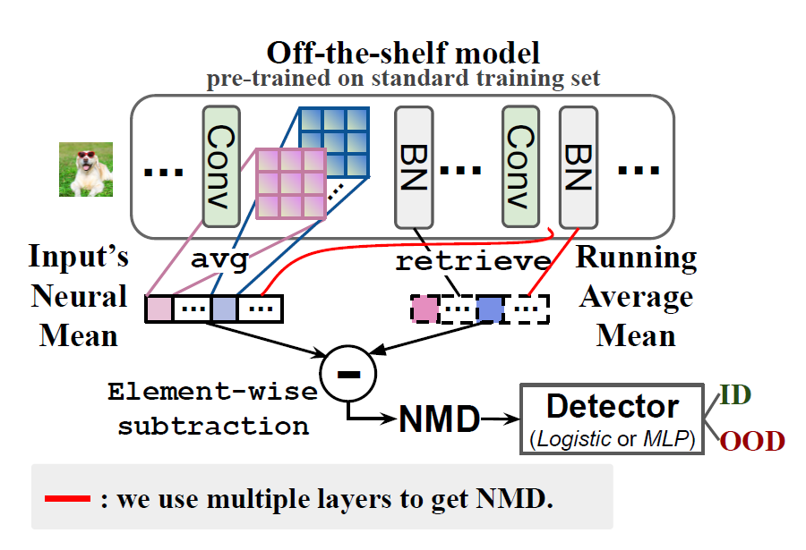

## Neural Mean Discrepancy for Efficient Out-of-Distribution Detection (CVPR, 2022)

Authors: Xin Dong, Junfeng Guo, Ang Li, Wei-Te Ting, Cong Liu, H.T. Kung

This is an **un-official** implementation.

You can read their paper here: [PDF](https://arxiv.org/abs/2104.11408)

### Requirements

Torch  
Torchvision  
Sklearn  
Tqdm

### Usage

Check out `demo.ipynb` for instructions on how to use this repo. 